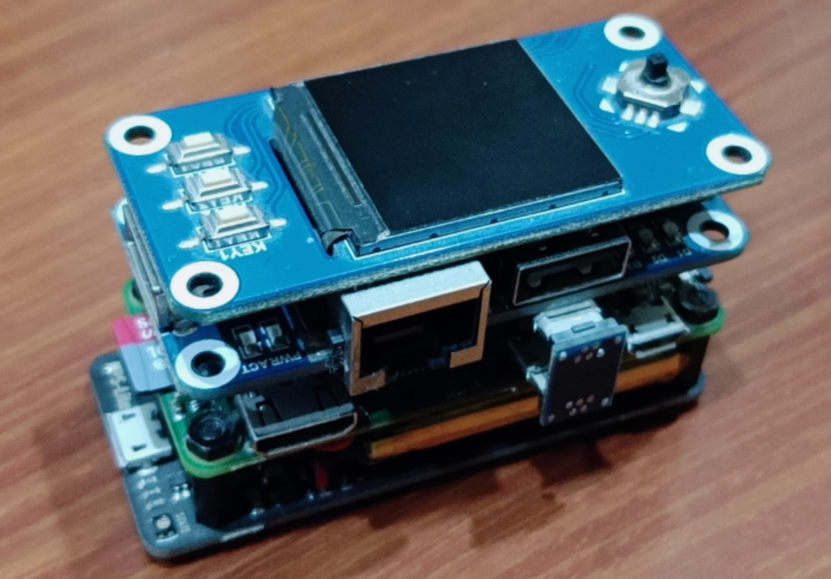
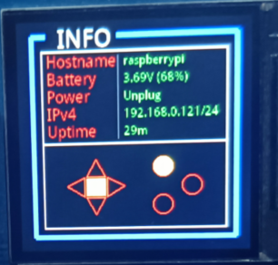
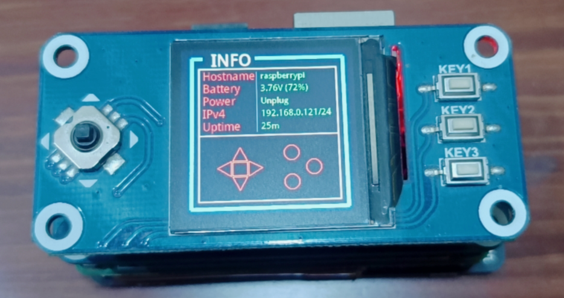

# RPI0w_1.3inchLCD_UPS
树莓派zero w，ip、电量等信息的显示

## 硬件

1. 树莓派zero w
2. [微雪 1.3inch LCD HAT]( https://m.tb.cn/h.f95NlCv?sm=097b4a)
3. [UPS_Lite 充电电源](https://m.tb.cn/h.f95nLU3?sm=a5f185) ( 将背面左下角两个焊盘短接，具体操作参考 [UPS-Lite V1.2 使用说明.pdf]([UPS-Lite/UPS-Lite V1.2 使用说明.pdf at master · linshuqin329/UPS-Lite (github.com)](https://github.com/linshuqin329/UPS-Lite/blob/master/UPS-Lite V1.2 使用说明.pdf)) )
4. ( 可选 ) [ETH/USB HUB HA 拓展板](https://m.tb.cn/h.fQf3g4H?sm=8723cf)



## 环境配置

```bash
#1、换源
sudo sed -i 's|raspbian.raspberrypi.org|mirrors.ustc.edu.cn/raspbian|g' /etc/apt/sources.list
sudo sed -i 's|//archive.raspberrypi.org|//mirrors.ustc.edu.cn/archive.raspberrypi.org|g' /etc/apt/sources.list.d/raspi.list
#2、更新
sudo apt update && sudo apt upgrade
#3、软件安装
sudo apt install vim git python3 python3-pip python3-dev build-essential i2c-tools
#4、更改设置
sudo raspi-config #将 SPI、I2C 使能(enable)
#5、pip换国内源
sudo python -m pip config set global.index-url https://pypi.tuna.tsinghua.edu.cn/simple
#6、三方库安装(这步可以跳过，raspbian系统自带)
sudo python -m pip install -U smbus spidev numpy pillow
#7、重启
sudo reboot
```

## 软件运行



```bash
# 拉取源码
git clone https://github.com/skb666/RPI0w_1.3inchLCD_UPS.git
# 运行
cd ./RPI0w_1.3inchLCD_UP
python main.py
```



